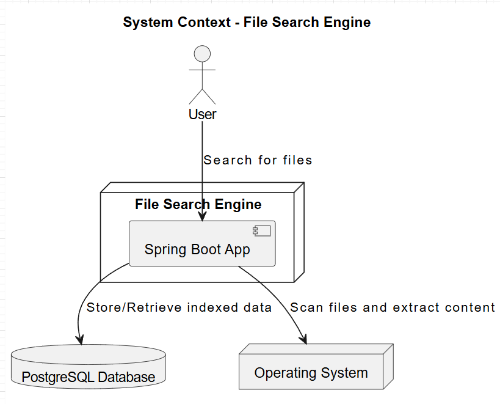
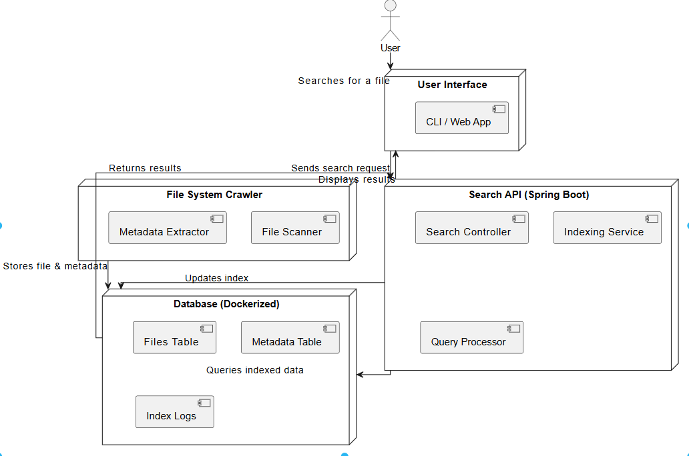
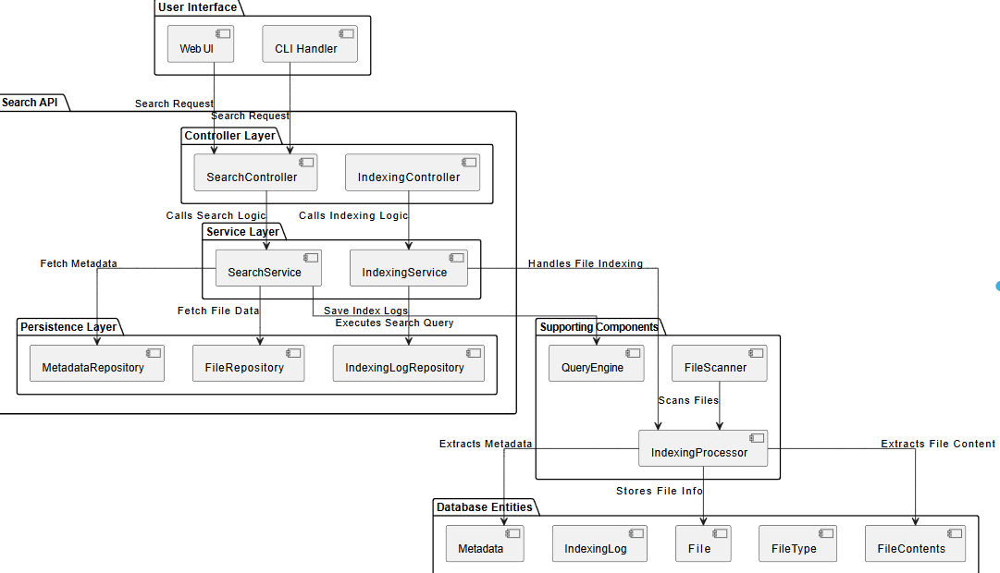

# Architecture Documentation - File Search Engine

## 1. System Context 

### Overview
The **File Search Engine** is a system that enables users to efficiently search for local files using filenames, content, and metadata. The system consists of a **Spring Boot application**, a **PostgreSQL database** running in a docker container, and interactions with the **operating system's file system**. Users can interact with the system via a command-line interface (CLI) or graphical user interface (GUI) (to be implemented in future iterations).

### System Scope and Purpose
The **primary goal** of this system is to provide a **fast and efficient local file search experience**. It achieves this by:
- **Indexing** files from a user-specified directory.
- **Extracting and storing metadata and content** in a structured database.
- **Providing a search interface** that allows users to find and preview files instantly.

This system will be **iteratively improved** to enhance search capabilities, indexing efficiency, and user experience.

### Key Components
At the highest level, the **File Search Engine** consists of the following **four main components**:

1. **User**
    - Interacts with the system through a search interface.
    - Inputs search queries and views the results.
    - Can select and open files directly from the results.

2. **Operating System (OS) File System**
    - Stores all local files to be indexed.
    - Provides file metadata such as name, size, and last modified date.
    - Allows the system to access and read file content.

3. **File Search Engine (Spring Boot Application)**
    - The core processing unit of the system.
    - Crawls and indexes files from the file system.
    - Stores indexed data into a **PostgreSQL database**.
    - Processes search queries and retrieves matching files.

4. **PostgreSQL Database**
    - Stores indexed **file metadata** and **text content**.
    - Supports **full-text search** for efficient query execution.
    - Maintains **indexing logs** to track progress and errors.

### System Interactions
The **File Search Engine** interacts with various components in the following way:

1. **Indexing Process**
    - The system scans a user-defined directory.
    - Extracts relevant **metadata** and **text content** from supported file types.
    - Stores the extracted information into the **PostgreSQL database**.

2. **Search Query Execution**
    - The user enters a **search query**.
    - The system performs a **full-text search** in the database.
    - Matching files are retrieved and presented as search results.
    - A **file preview** (first few lines of text) is shown if applicable.

3. **Result Interaction**
    - Users can **open files** directly from the search results.
    - The system logs queries and indexing activity for future optimization.

### Use Case Example
1. **User opens the search application**.
2. **Search for "report"**:
    - The system searches the database for files containing "report" in the name, content, or metadata.
    - Relevant files appear in the results list.
3. **User selects a file**:
    - A preview of the file is displayed (if applicable).
    - The user can **open the file** directly.

### Future Considerations
This initial version focuses on **basic file indexing and searching**. Future iterations will introduce:
- Support for more **file types** (e.g., PDFs, Word documents).
- **Real-time updates** when files are modified or added.
- A **graphical user interface (GUI)** for better usability.
- More **advanced ranking algorithms** for better search relevance.

---

## 2.Containers Level 

### Overview
At the **Containers Level**, we define the major deployable units of our Local File Search Engine. These are independent components that communicate via well-defined interfaces.

### Containers Breakdown

1. **User Interface (UI)**
   - This is the entry point where users interact with the search engine.
   - Can be a **CLI application** or a **Web UI** (future iterations).
   - Accepts search queries and displays results in real-time.

2. **Search API (Spring Boot Application)**
   - Acts as the **backend service** handling file indexing and search queries.
   - Can be split into multiple microservices if the logic increases and other functionalities are requested. 
   - Components:
      - `Search Controller`: Exposes REST endpoints for search.
      - `Indexing Service`: Handles file scanning and indexing.
      - `Query Processor`: Processes search requests and retrieves results.

3. **Database (Dockerized DBMS)**
   - Stores indexed file data and metadata.
   - Options:
      - **Relational DB (PostgreSQL)**: Ideal for structured queries.
   - Contains:
      - `Files Table`: Stores file paths and contents.
      - `Metadata Table`: Stores timestamps, file types, and sizes.
      - `Index Logs`: Tracks indexing progress.
      - `Files Contents` : Keeps the content for each file.
      - `Files Types` : Stores the possible types of the indexed files.
   - **Considerations**: The Database can be split into multiple databases, each serving for its microservice system that require specific data, allowing for a faster access to items stored. 

4. **File System Crawler**
   - Recursively scans the local file system for new or modified files.
   - Extracts relevant data and stores it in the database.
   - Components:
      - `File Scanner`: Reads directories and finds files.
      - `Metadata Extractor`: Gathers file properties (size, type, last modified date).

5. **Indexing Service**
   - Extracts textual content from files (eg., `.txt`, `.md`, `.pdf`).
   - Updates the search index in the database.
   - Supports incremental indexing to track changes.

### **Container Interactions**
- The **User Interface** sends search requests to the **Search API**.
- The **Search API** retrieves indexed results from the **Database** and returns them to the UI.
- The **File System Crawler** continuously scans for files and stores metadata.
- The **Indexing Service** extracts text content and updates the search index.

This architecture ensures **modularity**, **scalability**, and **maintainability** while keeping the search process **efficient**.

---

## 3.Components Level 

### Overview
At the **Components Level**, we break down each container into major structural building blocks. The backend follows a **Layered Architecture** (Controller, Service, and Persistence), and various components interact to handle file scanning, indexing, and search queries.

### Components Breakdown

#### **1. User Interface Components**
- **CLI Handler**: Handles user input from the command line.
- **Web UI (Optional)**: A frontend interface for search functionality.

#### **2. Search API (Spring Boot Application)**
- **Controller Layer**: Exposes REST endpoints.
    - `SearchController`: Accepts search queries and forwards them to the `SearchService`.
    - `IndexingController`: Handles file indexing requests.

- **Service Layer**: Implements core business logic.
    - `SearchService`: Processes search requests and interacts with the database.
    - `IndexingService`: Manages file indexing and metadata extraction.

- **Persistence Layer**: Handles database interactions.
    - `File Repository`: Manages file records.
    - `Metadata Repository`: Stores metadata information.
    - `IndexingLog Repository`: Tracks indexing progress.
    - `Contents Repository` : Manages files' contents.
    - `Files Types Repository` : Adds new accepted types for the files.

#### **3. Supporting Components**
- **FileScanner**: Recursively scans local files and sends them for processing.
- **IndexingProcessor**: Extracts text content, metadata, and updates the database.
- **QueryEngine**: Optimizes and executes search queries.

#### **4. Database Entities**
The database includes several key entities:
- `File`: Stores file names and paths.
- `FileType`: Categorizes file types (e.g., `.txt`, `.pdf`).
- `Metadata`: Stores timestamps, sizes, and properties.
- `IndexingLog`: Tracks file indexing status.
- `FileContents`: Stores extracted textual content for searching.

### **Component Interactions**
1. **User Interaction**
    - The user enters a search query via the **CLI/Web UI**.
    - The query is sent to `SearchController`, which calls `SearchService`.
    - `SearchService` fetches results using `QueryEngine` and retrieves file metadata.
    - Results are returned to the UI.

2. **File Indexing**
    - The **FileScanner** detects new files.
    - The **IndexingProcessor** extracts text, metadata, and updates the database.
    - `IndexingService` logs the process in `IndexingLogRepository`.

This modular design ensures **scalability**, **maintainability**, and **separation of concerns**.

---

## 4.Classes, Methods and Low-Level Functions

At the **Classes, Methods, and Low-Level Functions** level, we delve into the core implementation of each component within the system. This includes the specific classes, methods, and low-level functions that provide the functionality necessary for file indexing, searching, and managing metadata.

### 1. User Interface (CLI/Web UI)

### CLI Handler:
- **Classes**:
    - `CommandLineInterface`: Main class that runs the CLI, handling user input.
    - `SearchCommand`: Class that processes search queries.
    - `FileCommand`: Class for file-related commands (e.g., open, preview).
- **Methods**:
    - `runSearch(String query)`: Accepts search queries and forwards them to the backend for processing.
    - `displayResults(List<FileResult> results)`: Displays the search results to the user.
    - `openFile(String filePath)`: Opens the file selected by the user.

## 2. Search API

### Controller Layer:
- **Classes**:
    - `SearchController`: The primary controller that handles incoming search queries.
    - `IndexingController`: Exposes endpoints to initiate file indexing.
- **Methods**:
    - `searchFiles(String query)`: Handles the search requests, invoking the service to process queries.
    - `indexFiles()`: Triggers the file indexing process.
    - `getSearchResults(String query)`: Returns results after querying the database.

### Service Layer:
- **Classes**:
    - `SearchService`: The core service for executing search queries.
    - `IndexingService`: Manages the file indexing process.
- **Methods**:
    - `findFiles(String query)`: Executes a search against the database for matching files.
    - `processSearchQuery(String query)`: Prepares the query, optimizing it for the query engine.
    - `startFileIndexing()`: Initiates the scanning and indexing of files from the file system.
    - `updateMetadata(File file)`: Updates the file's metadata during indexing.

### Persistence Layer:
- **Classes**:
    - `FileRepository`: Repository for file data (file paths, names, contents).
    - `MetadataRepository`: Repository for file metadata (size, type, last modified date).
    - `IndexingLogRepository`: Repository that logs indexing progress.
    - `FileContentsRepository`: Repository for storing extracted textual content.
    - `FileTypeRepository`: Manages different accepted file types for indexing.

- **Methods**:
    - `saveFile(File file)`: Persists file information into the database.
    - `saveMetadata(Metadata metadata)`: Saves file metadata.
    - `saveIndexLog(IndexingLog log)`: Logs the progress of indexing.
    - `findFileByPath(String path)`: Retrieves a file by its path.
    - `findFilesByContent(String content)`: Searches for files containing specific content.

---

## 3. Supporting Components

### FileScanner:
- **Classes**:
    - `FileScanner`: Scans directories and identifies files.
    - `FileFilter`: Filters files based on specified criteria (e.g., file type, size).
- **Methods**:
    - `scanDirectory(String directoryPath)`: Recursively scans a directory for files.
    - `getFilteredFiles(List<File> files)`: Filters the list of files based on criteria.

### IndexingProcessor:
- **Classes**:
    - `TextExtractor`: Extracts textual content from files.
    - `MetadataExtractor`: Extracts metadata (e.g., size, type, date modified).
- **Methods**:
    - `extractText(File file)`: Extracts text content from a file.
    - `extractMetadata(File file)`: Extracts metadata from a file.

### QueryEngine:
- **Classes**:
    - `QueryEngine`: Optimizes and processes search queries.
- **Methods**:
    - `optimizeQuery(String query)`: Optimizes the query for better search performance.
    - `executeQuery(String query)`: Executes the optimized query and retrieves results.

